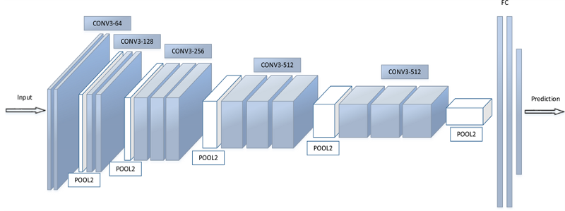
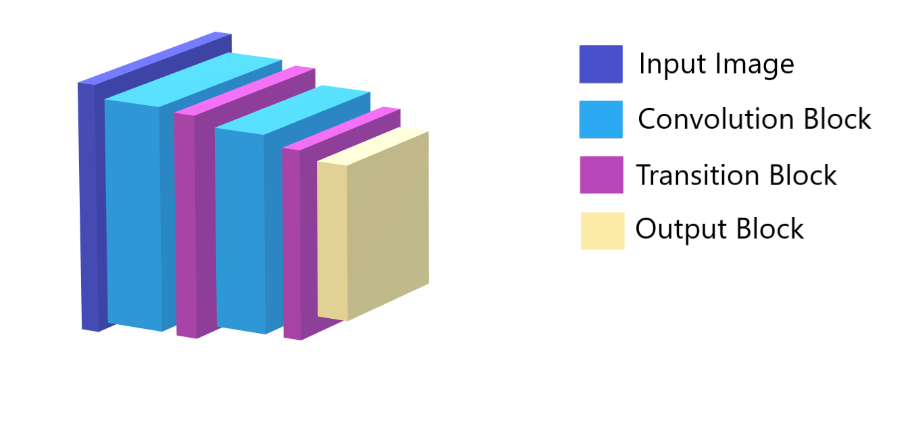
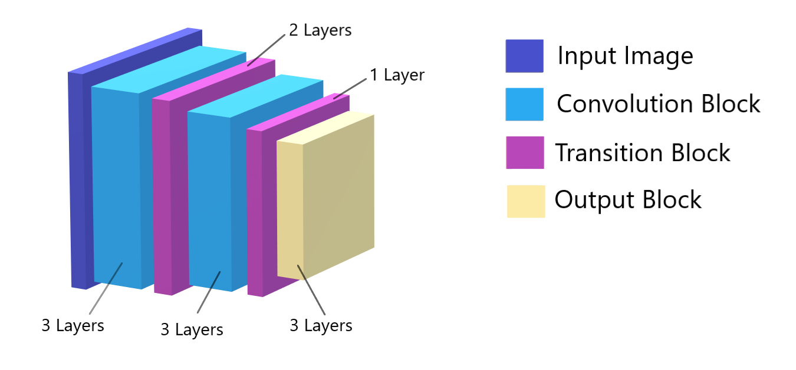
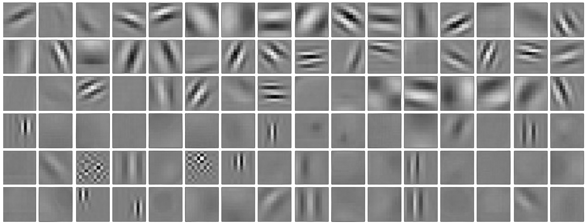
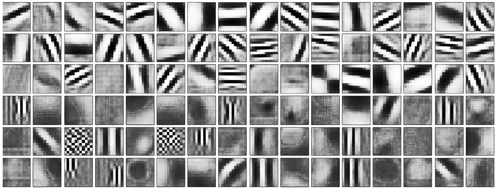
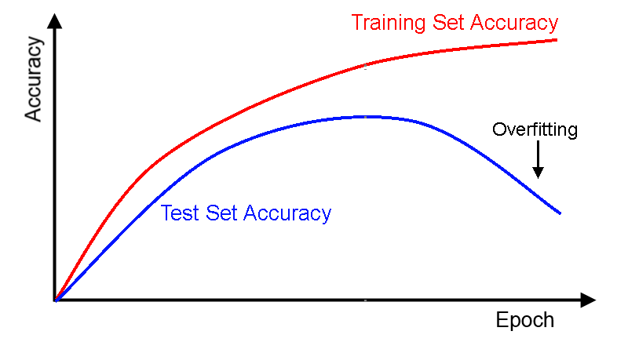

# Architectural Basics

The repository contains following notebooks of a model which was trained stepwise:

- [1st_DNN](<https://github.com/Shilpaj1994/DeepVision/blob/master/Assignment-4/1st_DNN.ipynb>) - **Model Architecture**
  - It contains a vanilla network with no Dropout, BN, variable learning rate, etc.
  - The aim of this version was to finalize the model architecture
  - Current model gave 98.27% validation accuracy in first epoch which shows the model has potential to achieve 99.40+% accuracy
- [2nd_DNN](https://github.com/Shilpaj1994/DeepVision/blob/master/Assignment-4/2nd_DNN.ipynb) - **Batch size, total parameters and batch normalization**
  - In this notebook, I have tried variable batch size, number of parameters and added batch normalization layer to the network
  - Among 32,64 and 128, batch size of 64 gave better results so I decided to use batch size of 64
  - Later, I reduced the number of kernels in the convolution layers so that total number of parameters come below 15000
  - With 7,784 parameters I got accuracy of 98.90% in 20th epoch
  - After adding batch normalization, number of parameters increased to 8120 with increase in accuracy to 99.07%
  - The model showed strong signs of overfitting  

- [3rd_DNN](https://github.com/Shilpaj1994/DeepVision/blob/master/Assignment-4/3rd_DNN.ipynb) - **Dropout**
  - In this notebook, to reduce the overfitting in previous version, I used dropout layer
  - I tried 3 variations for adding dropout layer:
    - After transition block
    - After every convolutional layer
    - After every layer in convolutional block
  - Adding dropout of 0.20 after transition block worked well and increased the accuracy to 99.36% in 25th epoch
- [4th_DNN](https://github.com/Shilpaj1994/DeepVision/blob/master/Assignment-4/4th_DNN.ipynb) - **Learning Rate**
  - In this notebook, I changed the learning rate from normal to scheduled decreasing learning rate
  - The learning rate drops after certain epochs
  - Validation accuracy became more stable and reached 99.41% in 14th epoch
- [5th_DNN](https://github.com/Shilpaj1994/DeepVision/blob/master/Assignment-4/5th_DNN.ipynb) - **Optimizers**
  - Tried using Adam, RMSprop, SGD optimizer along with the learning rate scheduler
  - Model with Adam gave best accuracy of 99.41% while other optimizer didn't cross 99.33% in 25 epochs
- [6th_DNN](https://github.com/Shilpaj1994/DeepVision/blob/master/Assignment-4/6th_DNN.ipynb) - **Removed Biases**
  - Removing biases reduced the number of parameters to 8026
  - The accuracy achieved was 99.43% on 22nd epoch

---

- **Final Model:**
  - Total number of parameters: **8,026**
  - Validation accuracy: **99.43%**  in 22nd epoch
  - First epoch validation accuracy: **98.09%**
  - Batch Size: **64**
  - Dropout: **0.20**
  - Learning rate: **Scheduler starting with 0.003**
  - Optimizer: **Adam**

---

## 1st DNN: Model Architecture

To finalize the model architecture, following is the sequence of importance:

1. Image Normalization
2. Architecture selection
3. 3x3 Convolution
4. 1x1 Convolution
5. MaxPooling
6. It's position and distance from prediction layer
7. Concept of Transition layer
8. Position of Transition layer
9. Receptive Field
10. Number of Layers
11. When to stop convolution?
12. Softmax
13. Validation Check
14. Network Performance

- Image Normalization is a part of data preprocessing so we should focus on that first
- Old architectures add lot of parameters so we should finalize modern architecture
- The modern architecture contains convolution block and transition block which is made of 3x3, 1x1, and maxpooling layer so we should know about these layers and their position
- Later, we should focus on transition block
- Receptive field is the concept which is useful to decide number of layers so using receptive field and above convolution layer knowledge, we can decide number of layers
- For output block, we should know when to stop convolution and start using larger kernel
- Softmax activation is responsible for prediction
- During training, we need to observe the results so we should put validation checks
- Based on the performance of the network, we can decide whether to continue with the architecture or change it.
- 

---

### Image Normalization

- When a Kernel is convolved over an input image, the maximum pixel value in the feature-map depends upon the maximum pixel value in the kernel
- Different kernels will have different maximum values and so their corresponding feature-maps will have different maximum values
- The feature-map with greater maximum pixel value will be louder while training the network
- To avoid biased activations of such kernels, we perform Normalization
- For normalization, we first convert the data into float so that we can get all the decimal values
- By dividing all the pixels by 255, all the pixel values will be restricted between 0.0 to 1.0. This is how we normalize the data to provide all the kernels same reference

### Architecture Selection

- The first thing I finalized was model architecture
- Till 2014, following was a common model architecture

- It contained convolution layers, maxpooling layers and fully connected layers before prediction layer
- Fully connected layers added a lot of parameters to the network and were replaced by 1x1 convolution
- Since 2016, a model with convolution blocks, transition blocks and output block is very common
- So, I decided to go on with following architecture

- After finalizing architecture, I needed to decide number of layers and placement of layers in the model
- The number of layers is decided based on a concept **Receptive Field**

### 3x3 Convolution Layer

- It is a matrix with 9 values which is used for feature extraction from an image.
- It reduces the x and y dimensions by 2 i.e. a 5x5 images gives 3x3 feature map as shown in the image.
- Matrix multiplication of kernel and same dimension part of the image generates value of one pixel in feature map.
- We use 3x3 for following reasons:
  - In even number of kernel dimension like 2x2, 4x4, etc. there is no concept of center. So, creating a symmetrical kernel is not possible. Since, we want our network to be scale and orientation invariant, we need symmetrical kernels to achieve that. Hence, we mostly use Odd number dimension kernel like 3x3  
  - Most of the acceleration libraries like cuDNN are optimized for 3x3 convolutions.
  - It can be used to build higher kernel size like 5x5, 7x7 by using multiple layers of 3x3. This will reduce the number of operations and thus improving the speed of the model
  - 3x3 kernels are computed faster than higher size kernels. Thus, increasing speed of the network

### 1x1 Convolution Layer

- It is widely used since 2016 instead of fully connected layers in the network.

- It is used to reduce the number of channels in the network.

- It is loss-less and carry forward only important features.

- It merges the already extracted features from the earlier channels. 

- It cannot extract new features from the channels.

  

### MaxPooling Layer

- MaxPooling(MP) is used to reduce the dimensions of the input channels
- We use a pooling of 2x2 i.e. among 2x2 part of the channel, we use the maximum pixel value
- In the above image MP of 3x3 is shown

### Position of MaxPooling Layer and it's distance from Prediction layer

- The placement of MP layer is very important in the model architecture
- Reduce is dimension of channels causes loss of information.
- Since, edges and gradients are formed in initial 2-3 layers, we do not use MP layer before these features are formed
- For prediction of an object, the input to the output block is very important 
- If we use MP before output block, it will reduce the information passing to the output block and will result in prediction accuracy
- Hence, MP layer is not used before output block

### Concept of Transition Layer

- Consider above image. The left point represents number of channels in input image
- As we add convolution block, the number of channels increases
- In modern networks we follow the Christmas tree pattern where we reduce the number of channels at the end of convolution block before passing it to another convolution block
- If we use 3x3 kernel to reduce the number of channels, we will destroy the information extracted by convolution block
- Hence, we use 1x1 convolution which merges the extracted features in lesser number of channels and are passed to the next convolution block
- The block containing 1x1 convolution to reduce the number of channels is known as transition block

### Position of Transition Layer

- As shown in the model architecture, Transition layer is placed after convolution layer 
- It is also placed before output block.

### Receptive Field:

- To classify an object correctly, the neurons in last layer of the network should see complete object in input image

- The digits size in MNIST dataset is about 26x26 pixels so a receptive field of 26x26 is the minimum requirement.

### Number of Layers:

- Number of layers depends upon receptive field and types of layers used in a network
- For a receptive field of 26x26, if we only use 3x3 convolution layers, we will need 13 convolution layers in the network other than flatten and softmax activation layer
- For this model architecture I have used:
  - In convolution block - 3 layers of 3x3 convolution
  - In transition block - 1x1 convolution layer with/without maxpooling(MP)
  - In output block - 1 convolution, 1 Flatten and 1 activation layer

- Since I have used 2 convolution blocks, 1 transition block with MP layer, 1 transition block without MP layer and output block, total number of layers are **12** 

### When do we stop convolutions and go ahead with a larger kernel or some other alternative (which we have not yet covered)

- When the channel dimensions becomes equal to the size of receptive field where we find gradients and edges, we stop convolving
- If we convolve on such small dimension channels, we won't be able to extract any meaningful information.
- For MNIST, I stopped at channel dimension of 5x5 and then used a larger kernel of 5x5 to get output of 1x1
- Average Global Pooling is also used to stop the convolutions

### Softmax

- It is probability like
- It just gives a class score distributed between 0 & 1
- It is not used for the problems where lives are concerned
- It is used to create difference between 1st and 2nd nearly similar activations

### Validation Checks

- During training model for same parameters and hyperparameters, the accuracy for first epoch will vary every time since the kernels are initialized randomly
- Depending on first epoch accuracy, the model will train. Accuracy fluctuation can happen during training because of learning rate and backpropagation
- This might result in achieving the accuracy in earlier epochs but a reduced accuracy in the last epoch
- Since last epoch accuracy is not always best accuracy, we always use validation checks during training. 

### Network Performance

- We can predict whether the network is going well or not based on the accuracy of first epoch
- If we have 2 networks with 95% and 98% accuracy of first epoch, then the network with higher first epoch accuracy will always perform better than lower first epoch accuracy
- Dropout can give us a boost of around 0.20%
- Learning rate scheduler can give us a boost of around 0.10%
- So, network giving an accuracy of about ___% less than desired accuracy then the network is not doing well.

---

## 2nd DNN: Batch Size, Parameters and Batch Normalization

### Batch Size

- Batch size is the number of images we pass through the network simultaneously
- It should be minimum equal to the number of classes in the network
- The more the batch size, the more variation of classes will pass simultaneously which will help network learn faster.
- With increase in batch size, accuracy increases and starts falling down after reaching a peak

### Kernels and how do we decide number of kernels

- Above image shows 12 kernels of size 3x3.
- 3x3 kernel is a matrix of 9 values which are used to extract features from an input image.
- In a CNN(Convolutional Neural Network), kernels of different sizes like 1x1, 3x3, 5x5, etc. are used to extract features from the input image.
- Kernels are initialized randomly before network training i.e. the 9 values of 3x3 kernels are randomly set before the network is trained.
- During network training, these values are adjusted to highlight specific feature in the image.
- No two kernels generate exact same feature map in a trained neural network. 
- Earlier, kernels had to be manually designed for feature extraction but in neural network multiple kernels are obtained to extract different features.
- The number of kernels in a layer is decided based on the constraints on number of parameters
- Generally, we use 32 kernels in first layer to start with and use 2^n kernels for other layers

### Batch Normalization

- After activation from a layer, the data is not normalized before going to next convolution layer
- Since data is not normalized, some kernels become louder while extracting features
- This might lead to missing some information
- Hence a batch normalization layer is added which normalize the inputs i.e. pushes the data from -1 to 1

### Distance of Batch Normalization from Prediction Layer

-  The final prediction is done by softmax activation layer.
- It takes in all the activations coming from the network to finally predict the result
- Since we want the network to predict correctly, we do not normalize the data coming in to the output block.
- Hence the last batch normalization layer is placed before the convolution layer in the output block

---

## 3rd DNN: Dropout

### Dropout and when to introduce it

- It does the regularization and avoid overfitting
- Dropout rate = 0.5 means
  - 50% of neurons are dropped randomly while training
  - Each kernel is multiplied by **0.5** while inference
- During Inference 
  - neurons are not dropped instead each and every single neuron is used.
  - To avoid the weightage increase, kernels are multiplied by dropout rate.
  - i.e. the activation output is multiplied with dropout value

- When the model performs well on training dataset while performs poorly on testing dataset then the model is overfitting
- To avoid overfitting dropouts are introduced in the network

---

## 4th DNN: Learning Rate

### Learning Rate

- During the backpropagation, the gradients are multiplied by the learning rate
- This product is used to modify the weights
- If learning rate is large then the model will never achieve minima
- If learning rate is small then the model will take lot more epochs to reach minima
-  The optimal way is to reduce the learning rate as we reach near minima

### Learning Rate Scheduler

- To implement the optimal way of reaching the minima, we use learning rate scheduler
- Using this, we reduce the learning rate after certain epoch
- This brings more stability to the validation accuracy 

---

## 5th DNN: Optimizers

### Adam vs SGD

- Adam performs better than the SGD optimizer

- Adam gave % accuracy while SGD gave % accuracy

---

## 6th DNN: Biases

### Removing Biases

- If the number of parameters are slightly more than the constrains then we can remove biases
- We have to use `use_bias = False` parameter in the convolution layers
- The number of parameters are so much more than the biases that they barely have any effect on the accuracy

---

### Number of Epochs and when to increase it

- It is the number of times the whole dataset is passed through the network while training
- If the model is training and not overfitting but the number of epochs are done then we can increase the number of epochs

---

## Summary

